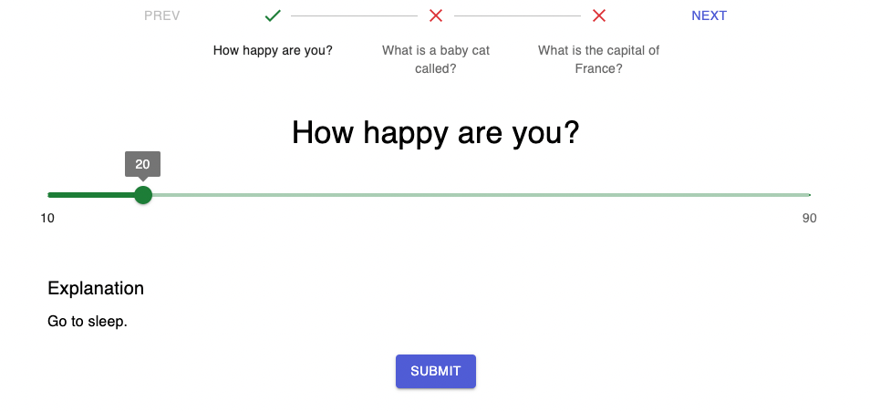

# Graasp App: Quiz

<div align="center">

<a href="https://choosealicense.com/licenses/agpl-3.0/#"></a>
</div>

An app to create interactive quizzes on the Graasp platform.



The app support multiple types of questions:

- simple text responses
- multiple answer questions
- quantitative answers using a slider

## Usage

If you wish to run the app in your local environnement you will need to have a `.env.local` file with the following content:

```sh
# Domain for the react app
REACT_APP_GRAASP_DOMAIN=localhost
# ID of the app (can be generated online https://www.uuidgenerator.net/version4)
# an example could be "5b321475-ecb8-4df2-9e32-f4a4cd444fa4"
REACT_APP_GRAASP_APP_KEY=<mock-id-you-need-to-generate>
# Enable mock API (to use the app without the graasp backend)
REACT_APP_ENABLE_MOCK_API=true
# Address of the API host (graasp backend)
REACT_APP_API_HOST=http://localhost:3000
# Sentry DSN url (uncomment to use)
# REACT_APP_SENTRY_DSN=

# Overwrite the default 3000 port
PORT=3012

# Overwrite the "baseUrl" of Cypress to match the port used by the running local app
CYPRESS_BASE_URL=http://localhost:3012
```

To run the app locally:

```bash
# install the dependencies
yarn install # or "yarn"
# run the app
yarn start
```

To open Cypress to look at the tests:

```bash
yarn cypress:open
```
